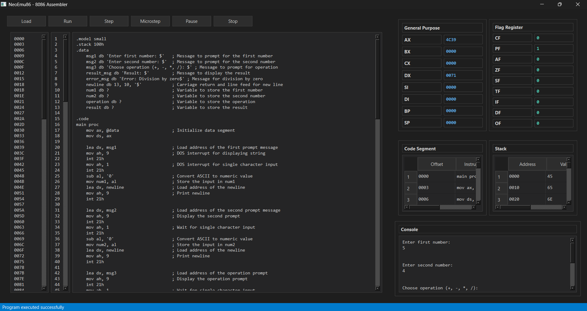

# NeoEmu86 🚀

A modern, feature-rich Intel 8086 assembly emulator with a sleek dark-themed UI. NeoEmu86 provides a contemporary development environment for learning and working with 8086 assembly language.



## ✨ Features

- 🎨 Modern dark-themed UI inspired by VS Code
- 📝 Advanced code editor with syntax highlighting
- 🔢 Real-time register and flag monitoring
- 🧮 Memory viewer with hexadecimal display
- ⚡ Step-by-step debugging (F8)
- 🏃‍♂️ Full program execution (F5)
- 💻 Interactive console for I/O operations
- 📊 Register and flag state visualization
- 📁 File operations (New, Open, Save)
- 🔄 Program reset functionality

## 🛠️ Installation

### Prerequisites
- Python 3.8 or newer
- PyQt6

### Setup

1. Clone the repository:
```bash
git clone https://github.com/Seyamalam/neoemu86.git
cd neoemu86
```

2. Install dependencies:
```bash
pip install -r requirements.txt
```

## 🚀 Usage

Run the emulator:
```bash
python modern_emu8086_gui.py
```

### Basic Operations

- **New File**: Create a new assembly program
- **Open**: Load an existing .asm file
- **Save**: Save your current program
- **Run (F5)**: Execute the entire program
- **Step (F8)**: Execute one instruction at a time
- **Reset**: Clear all registers and memory

### Example Program

```assembly
.model small
.stack 100h
.data
    msg1 db 'Enter first number: $'
    msg2 db 'Enter second number: $'
    result_msg db 'Result: $'
    newline db 13, 10, '$'
    num1 db ?
    num2 db ?
    result db ?

.code
main proc
    mov ax, @data
    mov ds, ax

    ; Display first prompt
    lea dx, msg1
    mov ah, 9
    int 21h
    
    ; Get first number
    mov ah, 1
    int 21h
    sub al, '0'
    mov num1, al

    ; Display second prompt
    lea dx, msg2
    mov ah, 9
    int 21h
    
    ; Get second number
    mov ah, 1
    int 21h
    sub al, '0'
    mov num2, al

    ; Add numbers
    mov al, num1
    add al, num2
    add al, '0'
    mov result, al

    ; Display result
    lea dx, result_msg
    mov ah, 9
    int 21h
    mov dl, result
    mov ah, 2
    int 21h

    ; Exit program
    mov ah, 4ch
    int 21h
main endp
end main
```

## 🔧 Supported Instructions

Currently supported 8086 instructions include:
- `MOV` - Move data between registers or load immediate values
- `ADD` - Add two values
- `SUB` - Subtract two values
- `LEA` - Load Effective Address
- `INT` - Interrupt (21h services)

Supported INT 21h services:
- Function 1: Single character input
- Function 2: Display character
- Function 9: Display string
- Function 4Ch: Program termination

## 🌟 Features in Detail

### Code Editor
- Syntax highlighting for assembly keywords
- Line numbers
- Auto-indentation
- Comment highlighting

### Register View
- Real-time updates of register values
- Hexadecimal display
- Support for 16-bit and 8-bit registers

### Memory View
- 64KB memory space visualization
- Hexadecimal display
- Organized offset view

### Flags Panel
- Real-time flag status updates
- Support for all 8086 flags (ZF, SF, CF, OF, AF, PF)

### Interactive Console
- Terminal-style I/O
- Support for program input/output
- Clear display of program execution

## 🤝 Contributing

Contributions are welcome! Here are some ways you can contribute:

1. 🐛 Report bugs
2. 💡 Suggest new features
3. 📝 Improve documentation
4. 🔧 Submit pull requests

## 📝 License

This project is licensed under the MIT License - see the [LICENSE](LICENSE) file for details.

## 🙏 Acknowledgments

- Inspired by the classic Emu8086
- Built with PyQt6
- Dark theme inspired by VS Code

## 📞 Contact

- GitHub: [@Seyamalam](https://github.com/Seyamalam)
- Email: seyamalam41@gmail.com

---
Made with ❤️ for assembly enthusiasts 